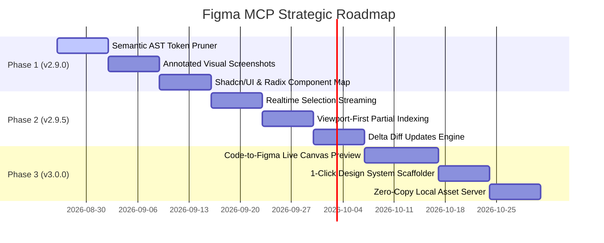

# 🗺️ Figma MCP Roadmap (v2.9.0 → v3.0.0)

> Strategic optimization roadmap for **figma-mcp** focusing on **Workflow Ergonomics**, **Rust Engine Performance**, and **AI / LLM Context Intelligence**.

---

## 📊 Roadmap Overview

---

## 🎯 Phase 1: AI & Context Optimization (v2.9.0)
*Target: Maximize LLM code generation precision & cut context token usage by another 40%.*

- [x] **1.1. Semantic AST Token Pruning (`codegen.rs`)**
  - Strip redundant layout defaults (`opacity: 1`, `visible: true`, `padding: 0`, `blendMode: PASS_THROUGH`).
  - Compress output into token-optimized clean specifications (`clean-spec` pseudo-JSX format).
  - Reduce LLM prompt token footprint for large trees.

- [x] **1.2. Annotated Screenshots with Bounding-Box Overlays**
  - Add `withAnnotations: true` to `screenshot` and `figma_read`.
  - Automatically extract structured bounding-box coordinates and numbered index labels (`[1] Navbar`, `[2] Hero CTA`, `[3] Card`) onto exported screenshot metadata.
  - Enable multimodal models (Gemini / Claude) to cross-reference visual layout directly with code tree.

- [x] **1.3. Smart Component Mapping (Shadcn/UI & Radix)**
  - Enhance `figma_to_code` to detect standard design system patterns (Buttons, Badges, Dialogs, Avatars, Inputs, Cards).
  - Automatically map Figma variants to Shadcn UI / Tailwind component imports (`@/components/ui/button`, `@/components/ui/card`, etc.) via `framework="react-shadcn"`.

- [x] **1.4. Responsive Breakpoint & Flex Inference**
  - Infer Tailwind responsive classes (`flex-col md:flex-row`, `flex-wrap`, `flex-1`, `w-full`, `max-w-screen-xl`) using Figma AutoLayout constraints and min/max width rules.

---

## ⚡ Phase 2: Realtime Engine & Memory Scaling (v2.9.5)
*Target: Zero-latency developer experience for massive (>50,000 layers) design systems.*

- [ ] **2.1. Realtime Selection Event Streaming**
  - Figma plugin broadcasts `selectionchange` events directly via WebSocket to Rust memory.
  - Server caches `active_selection` in real time.
  - Calling `figma_inspect_node` without arguments immediately returns the active node without canvas latency.

- [ ] **2.2. Viewport-First Partial Indexing**
  - Prioritize indexing visible frames inside the active designer viewport and Main Components.
  - Background lazy-loading for distant canvas sections and pages.

- [ ] **2.3. Fine-Grained Delta Diff Engine**
  - Send lightweight delta updates `{ id: "123:45", diff: { fills: [...] } }` instead of full node trees upon canvas edits.
  - Apply in-memory patch in `< 0.1ms`.

- [ ] **2.4. Zero-Copy Local Asset Server**
  - Expose a fast static asset route (`http://127.0.0.1:38451/assets/...`) for high-res images and SVGs.
  - Eliminate base64 string bloat across the bridge.

---

## 🚀 Phase 3: Bidirectional Ecosystem & Workflows (v3.0.0)
*Target: Complete two-way bridge between codebases and Figma.*

- [ ] **3.1. Code-to-Figma Live Canvas Preview (`figma_preview_code`)**
  - AI takes generated React/HTML/Tailwind snippet, parses AST, and renders it back onto a temporary Figma canvas frame `[AI Preview]`.
  - Allows instant visual verification inside Figma Desktop before code is committed.

- [ ] **3.2. 1-Click Design System Scaffolder (`figma_scaffold_project`)**
  - One MCP command to inspect the entire Figma file and scaffold project directory:
    - `src/components/ui/*`
    - `src/tokens/*`
    - `tailwind.config.ts`
    - `globals.css`

- [ ] **3.3. Multi-File Design System Sync**
  - Support cross-file library dependencies and shared variable collections across multi-tab Figma workspaces.

---

## 📈 Tracking & Milestones

| Milestone | Status | Target Date | Key Deliverables |
| :--- | :---: | :---: | :--- |
| **v2.8.5** | ✅ Released | 2026-08-26 | `figma_to_code`, `figma_get_tokens`, `figma_export_assets`, In-Memory Fast Indexing, `@latest` hot-reload daemon |
| **v2.9.0** | 🚧 Planning | 2026-09-09 | Clean AST Pruning, Annotated Visual Screenshots, Shadcn/UI Mapper |
| **v2.9.5** | ⏳ Backlog | 2026-09-30 | Realtime Selection Streaming, Viewport-First Indexing, Delta Diffs |
| **v3.0.0** | ⏳ Backlog | 2026-10-24 | Bidirectional `figma_preview_code`, 1-Click Project Scaffolding |

---

*Maintained by [@BuiHung1612](https://github.com/BuiHung1612).*
